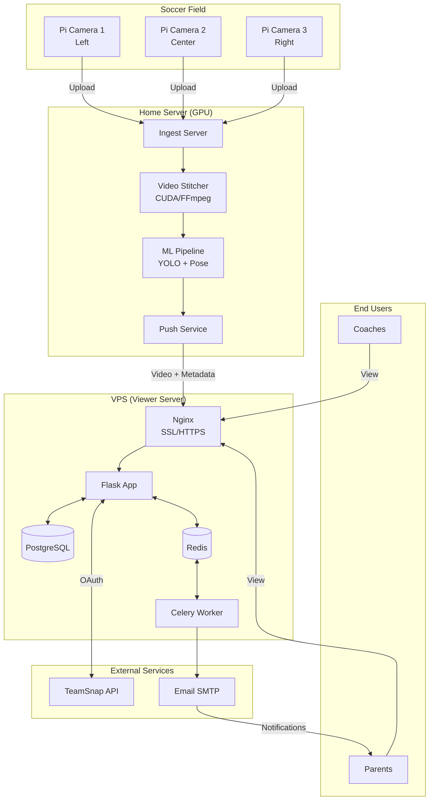
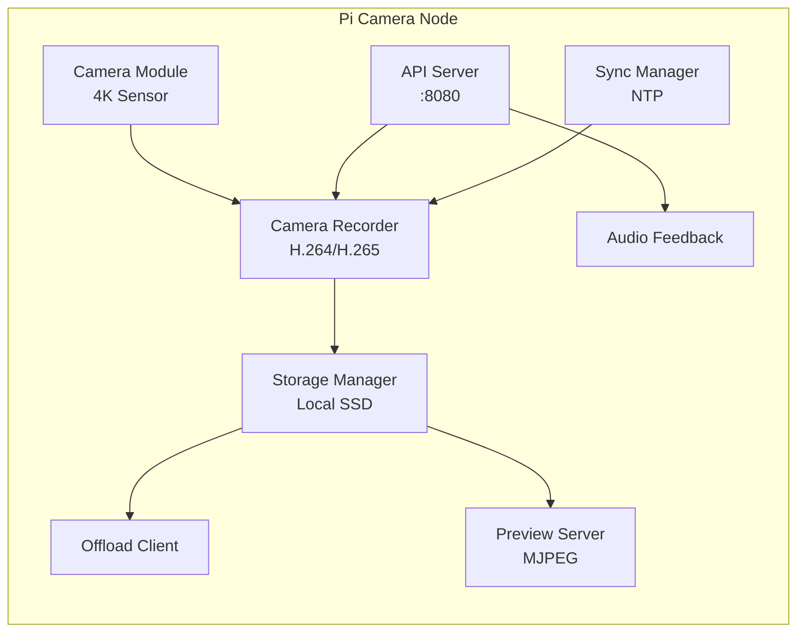
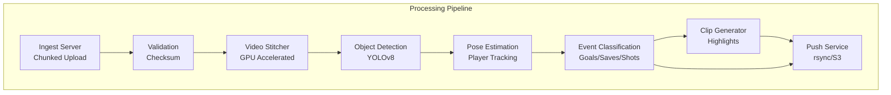
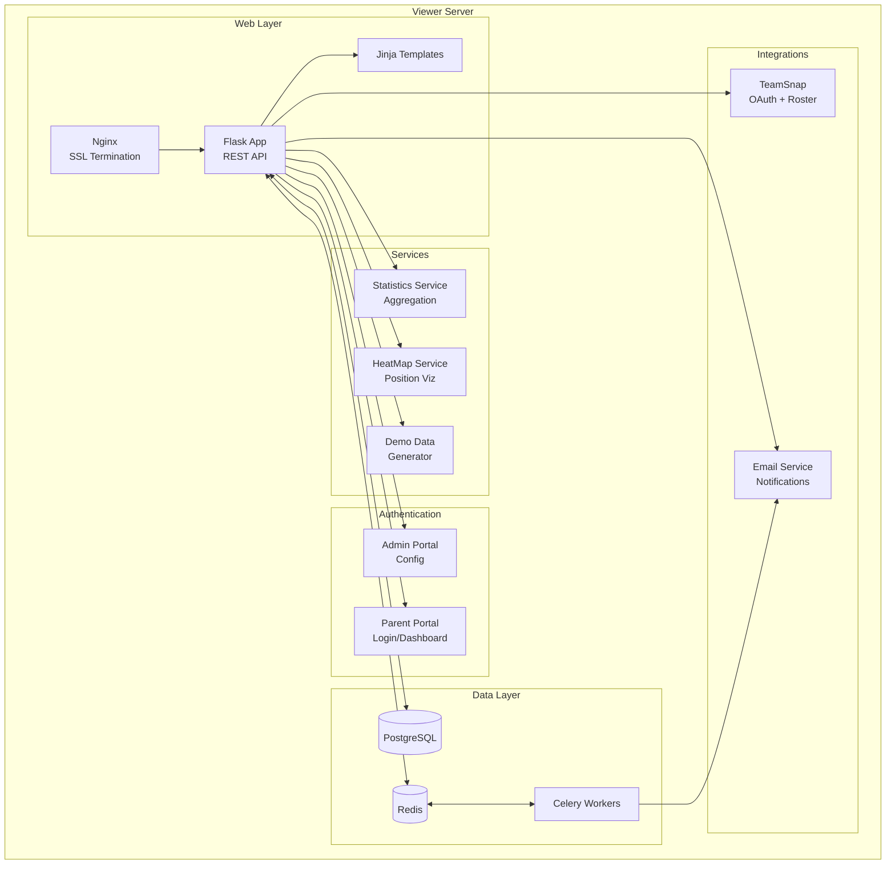
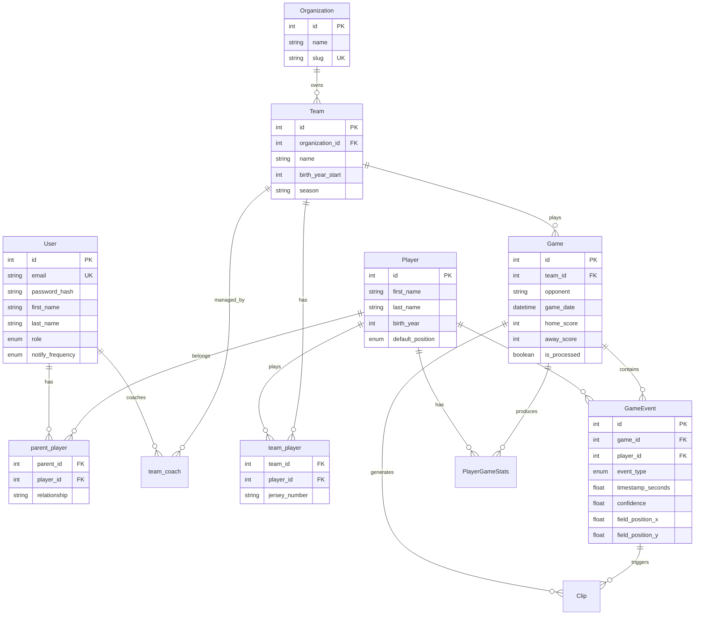
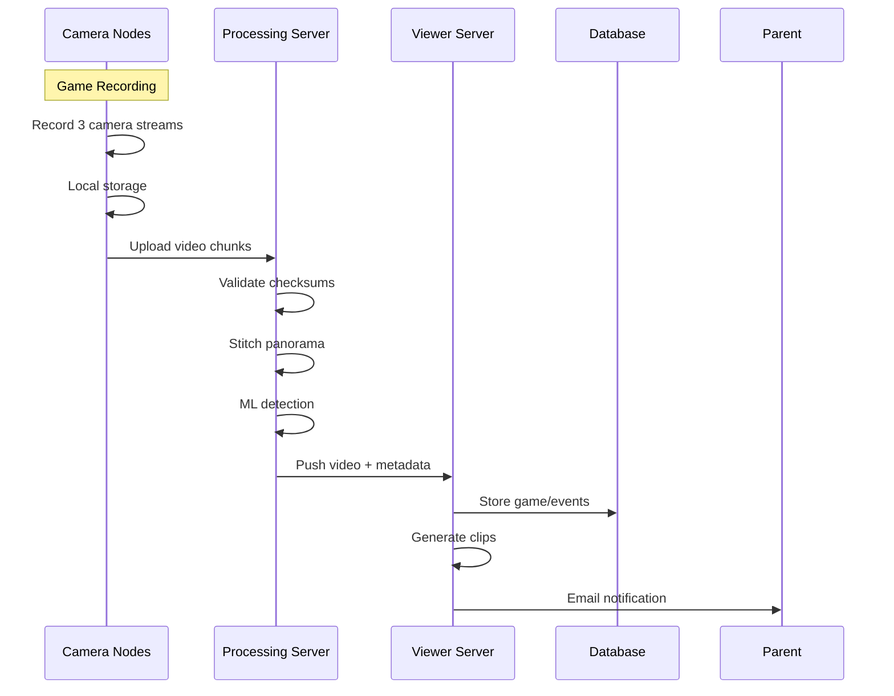
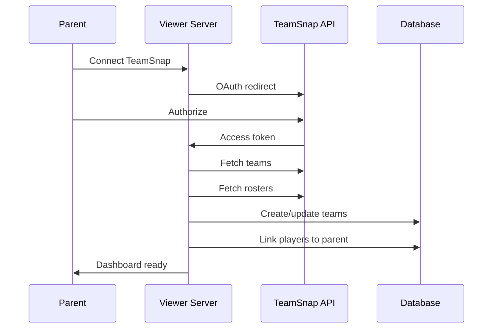
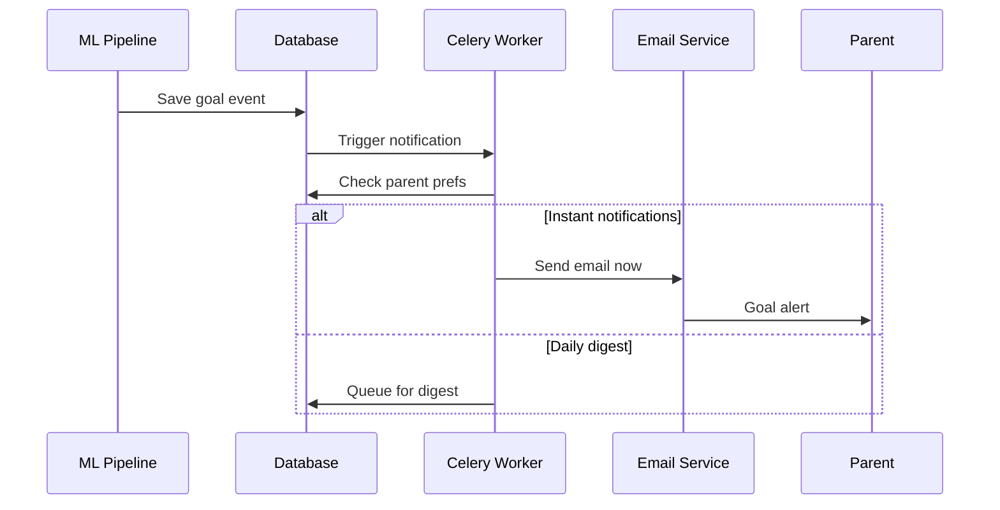
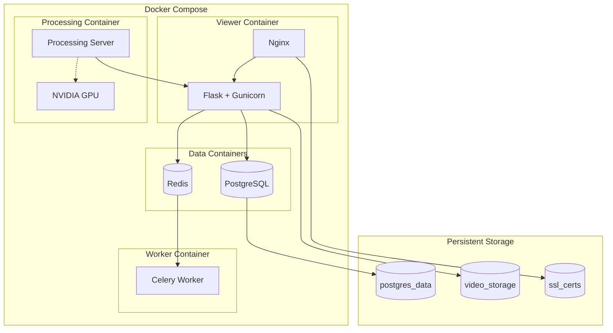

# System Architecture

Multi-Camera Soccer Recording System architecture documentation.

## High-Level Overview



## Component Details

### Camera Nodes (Raspberry Pi 5)



### Processing Server Pipeline



### Viewer Server Services



## Database Schema



## Data Flow Sequences

### Recording Session



### TeamSnap Integration



### Notification Flow



## Deployment Architecture



## Technology Stack

| Layer | Technology |
|-------|------------|
| **Camera Hardware** | Raspberry Pi 5 + 4K Camera Module |
| **Camera Software** | Python, picamera2, Flask |
| **Processing** | Python, CUDA, OpenCV, YOLOv8, FFmpeg |
| **Web Server** | Nginx + SSL, Flask + Gunicorn |
| **Database** | PostgreSQL + SQLAlchemy ORM |
| **Task Queue** | Redis + Celery |
| **Containerization** | Docker + Docker Compose |
| **External APIs** | TeamSnap OAuth, SMTP |

## Key Directories

```
Traloxolcus-Claude/
├── src/soccer_rig/           # Camera node code
│   ├── camera/               # Video recording
│   ├── coordinator/          # Multi-camera sync
│   └── offload/              # Upload to processing
├── processing-server/        # Home GPU server
│   └── src/processing_server/
│       ├── ingest/           # Receive uploads
│       ├── stitcher/         # Video stitching
│       ├── ml/               # YOLO detection
│       └── push/             # Sync to viewer
├── soccer-rig-server/        # Viewer server (VPS)
│   └── src/
│       ├── models.py         # Database schema
│       ├── services/         # Stats, heatmaps
│       ├── integrations/     # TeamSnap, email
│       ├── admin.py          # Admin portal
│       └── parent_portal.py  # Parent dashboard
└── docker-compose.yml        # Deployment config
```
